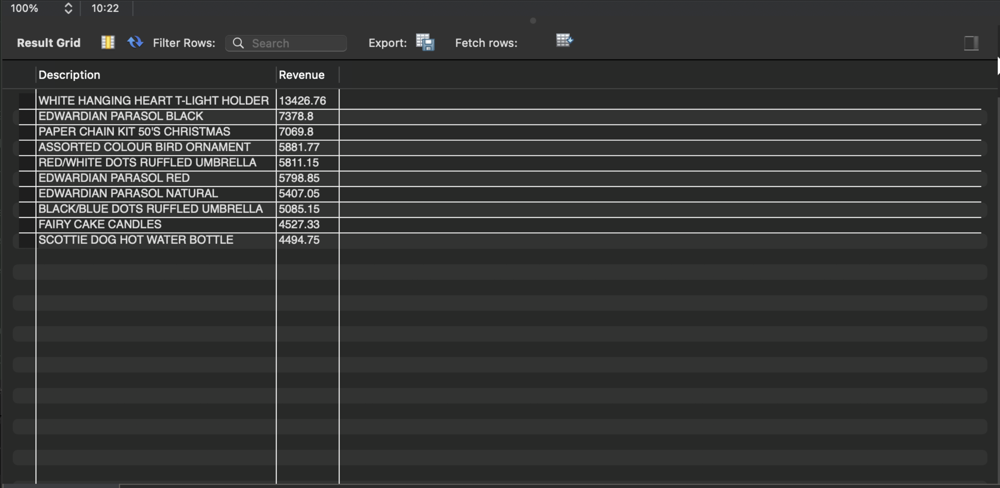
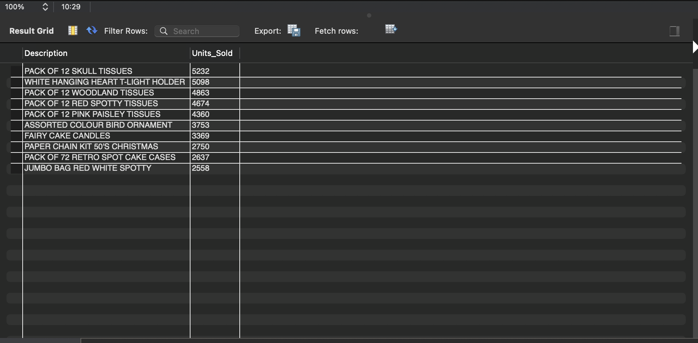
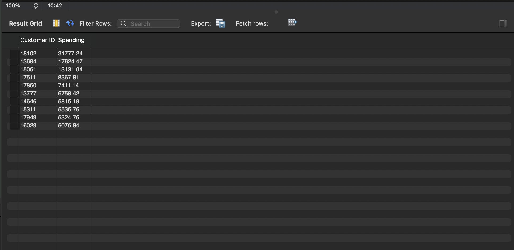
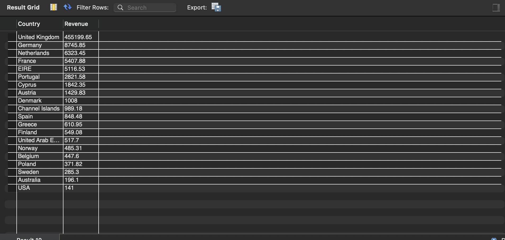

# Online Retail Sales Analysis using SQL

## Project Overview

This project analyzes the **Online Retail II** dataset using **MySQL** to extract meaningful business insights from transactional sales data. SQL queries were used to identify sales trends, customer purchasing behavior, product performance, and regional revenue distribution. The objective is to demonstrate practical SQL skills for data analytics by solving real-world business problems through data exploration and analysis.

---

## Dataset

- **Dataset:** Online Retail II UCI
- **Source:** UCI Machine Learning Repository
- **Period:** 2009–2010
- **Records:** Retail transactions including invoices, products, customers, quantities, prices, and countries.

---

## Tools Used

- MySQL Workbench
- SQL
- GitHub

---

# Business Objectives

- Analyze overall sales performance.
- Identify top-performing products.
- Discover the highest-value customers.
- Compare sales performance across different countries.
- Calculate important business KPIs.
- Demonstrate SQL querying and analytical skills.

---

# Key Metrics

| Metric | Description |
|---------|-------------|
| Total Revenue | Total revenue generated from all sales transactions. |
| Total Orders | Total number of unique customer orders. |
| Total Customers | Number of unique customers in the dataset. |
| Average Order Value | Average revenue generated per transaction. |

---

# SQL Analysis & Business Insights

## 1. Total Revenue

**Objective**

Calculate the total revenue generated across all transactions. Which was - 49333.xxx

**Business Insight**

Provides an overall measure of business performance and helps evaluate total sales generated during the analysis period.

---

## 2. Total Orders

**Objective**

Determine the total number of customer orders. Which was found to be - 1086

**Business Insight**

Helps understand transaction volume and customer purchasing activity.

---

## 3. Total Customers

**Objective**

Calculate the number of unique customers. Which was - 789

**Business Insight**

Measures the size of the active customer base and supports customer growth analysis.

---

## 4. Average Order Value

**Objective**

Calculate the average revenue generated per order = 21.46

**Business Insight**

Average Order Value helps evaluate customer spending behavior and can be used to monitor pricing strategies and promotional effectiveness.

---

## 5. Top Products by Revenue

**Objective**

Identify products generating the highest revenue.

**Business Insight**

The analysis identified products contributing the highest revenue, with **WHITE HANGING HEART T-LIGHT HOLDER** emerging as the leading revenue-generating product. These products can be prioritized for inventory planning, pricing strategies, and promotional campaigns to maximize profitability.



---

## 6. Top 10 Best Selling Products

**Objective**

Identify products with the highest sales volume.

**Business Insight**

Products such as **PACK OF 12 SKULL TISSUES** achieved the highest unit sales. High-volume products indicate consistent customer demand and should be maintained with adequate inventory levels to prevent stock shortages.



---

## 7. Top Customers by Spending

**Objective**

Identify customers contributing the highest revenue.

**Business Insight**

The analysis highlights high-value customers based on total spending. These customers are ideal candidates for loyalty programs, personalized promotions, and retention strategies that can increase long-term customer value.



---

## 8. Revenue by Country

**Objective**

Compare revenue generated across different countries.

**Business Insight**

The **United Kingdom** generated the highest revenue by a significant margin, indicating it is the company's primary market. Other countries contribute comparatively smaller revenue streams, presenting opportunities for market expansion and targeted regional marketing.



---

# Skills Demonstrated

- SQL Queries
- Data Aggregation
- GROUP BY
- ORDER BY
- Aggregate Functions
- DISTINCT
- Business Analytics
- KPI Analysis
- Data Exploration
- Revenue Analysis
- Customer Analytics
- Product Performance Analysis

---

# Repository Structure

```
Online-Retail-Sales-Analysis-using-SQL
│
├── README.md
├── queries.sql
├── database.sql
├── results.md
└── screenshots
    ├── top-products-by-revenue.png
    ├── top-10-best-selling-products.png
    ├── top-customers.png
    └── revenue-by-country.png
```

---

# Future Improvements

- Monthly and yearly sales trend analysis
- Customer segmentation using RFM analysis
- Sales forecasting
- Product category analysis
- Window Functions (RANK, DENSE_RANK)
- Interactive Power BI Dashboard

---

## Author
Bristi Biswas
